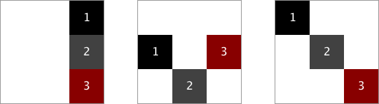

# Boilerplate de ejercicios de repaso de Flexbox y Position (promoción Dorcas)

Os proponemos un pequeño repaso del uso de flexbox y position intentado distribuir tres elementos dentro de un cuadrado según los esquemas proporcionados en el siguiente [pdf](assets/ejercicios-de-flex-position-responsive.pdf)

## Instrucciones

1. Clona este repositorio que contiene los archivos de partida.
2. Resuelve cada ejercicio en su propio html/css.

:)
