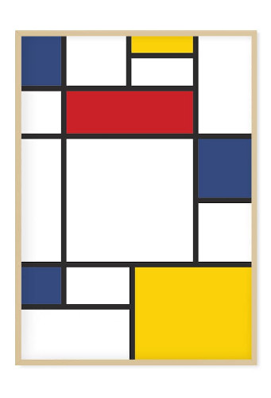

# Piet Mondrian se inspiró en CSS-Grid para sus cuadros

Por todo el mundo es sabido que [Piet Mondrian](https://es.wikipedia.org/wiki/Piet_Mondrian) era, además de pintor, un maquetador de páginas web exquisito.

Famosa es su explicación de cómo se le ocurrió pintar sus composiciones de cuadros de colores. En una entrevista en la revista People en 1942 explicó:

"Pues estaba un día aburrido en mi taller de pintura cuando me puse a trastear con CSS-Grid poniendo filas y columnas al azar y poniendo background-color a diestro y siniestro. Cuando de repente me quedó una composición super chuli. La llamaré rejilla de cuadros rojos, azules y amarillos (con huecos blancos)."

Entonces su ayudante que estaba por allí vio el cuadro y dijo:

"Pero bueno Piet, esto es un melocotonazo de miedo, ahí hay dinero!!!".

Entre Piet y su ayudante se pusieron manos a la obra a crear cuadros como este

## Ejercicio

Vamos a ser pintoras de brocha fina!!! Usando CSS-Grid tenemos pintar este cuadro para 3 anchos de pantalla:

* Para pantallas de menos de 600px todos los cuadros deben estar en una única columna con N filas.
* Para pantallas de menos de 990px todos los cuadros deben estar en dos únicas columnas con N filas.
* Para pantallas mayores o iguales a 990px todos los cuadros deben estar exactamente igual que en la foto.

Al turrón!!!