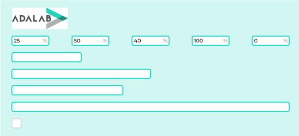

# Gráfico de barras

Hoy vamos a hacer una página que muestre un gráfico de barras como el de la siguiente imagen:

En la [esta página])(https://beta.adalab.es/ejercicios-extra/js-bar-charts/) podéis ver el resultado esperado.

## Elementos de la página

- En la parte superior de la página debe aparecer el logotipo de Adalab.
- En el cuerpo de la página debe aparecer:
  - Un formulario con 5 campos. Cada campo debe tener un **%** a la derecha.
  - 5 barras horizontales.

> El valor del primer campo indica el ancho de la primera barra, el del segundo campo el ancho de la segunda barra...

## Funcionamiento

### Fase 1:

Al arrancar la página:

- Los campos de texto deben tener el valor 0.
- Las barras deben tener un **ancho mínimo** igual a su alto, es decir, ser un cuadrado. Por ejemplo tienen que medir 30 x 30 px.

### Fase 2:

Cuando la usuaria cambie el número de uno de los campos debemos:

- Comprobar si el valor introducido es un número entre 0 y 100.
- Si no es un número menor de 0 debemos poner el número 0.
- Si es un número mayor de 100 debemos poner el número 100.

### Fase 3:

Cuando la usuaria cambie el número de uno de los campos debemos cambiar el ancho de la barra correspondiente de forma porcentual:

- Si la usuaria ha escrito 100 la barra ocupa el 100% del ancho disponible.
- Si la usuaria ha escrito 50 la barra ocupa el 50% del ancho disponible.
- Si la usuaria ha escrito 0 la barra ocupa el mínimo ancho que hemos indicado en la fase 1.

### Fase 4:

Las barras tienen que cambiar el ancho con una transición.

### Fase 5:

Ya hemos hecho que cuando un campo de texto tiene el valor 0 la barra correspondiente tiene el ancho mínimo. Ahora además vamos a hacer que cuando un campo tenga el valor el color de la barra correspondiente aparezca en gris, como si estuviera deshabilitada.

### Fase 6:

Cuando una barra mida menos del 50% el color de fondo de la misma debe ser blanco.
Cuando una barra mida más del 50%, el color de fondo de la misma deber ser verde.

### Fase 7:

La barra más larga debe tener un color del borde diferente a la de las demás.

### Fase 8:

Como sabes desde JS podemos cambiar los estilos CSS de dos formas:

- Con clases
- A fuego con `element.style.borderColor = 'red';`

Hay que refactorizar todo el código JS y CSS para que solo utilicemos clases (excepto el ancho de las barras).

El resto de estilos los debemos cambiar añadiendo y quitando clases CSS a las barras.

---

> Nota: tienes libertad creativa para elegir colores y formas de bordes, fuentes, tamaños...

Al turrón!!!

# Solución

Para solucionar este ejercicio hemos dividido el flujo de acciones en 2 fases:

### Fase 1: Obtenemos los datos

Cuando la usuaria modifica un input leemos y guardamos los valores de los inputs en la constante `data.value`. Si la usuaria pulsa en **Reset**, **Random** o **Increment** también modificamos y guardamos los nuevos valores en `data.value`.

A partir de ahí comprobamos que todos los datos son correctos. Si no lo son los cambiamos para que sí lo sean y los volvemos a guardar en `data.value`.

En esta primera fase nos hemos centrado solo en asegurar nuestros datos almacenados en `data.value`. Esta es nuestra única fuente de verdad.

### Fase 2: Actualizamos todos los elementos del DOM

Actualizamos todos los elementos del DOM como:

1. Valores de los inputs: puede que estos valores estén desactualizados y por ello debemos actualizarlos con los nuevos valores de `data.value`.
1. Actualizar los anchos.
1. Actualizar las clases.

En esta segunda fase nos hemos centrado en actualizar el DOM partiendo de nuestra única fuente de verdad: `data.value`.

### Explicación:

Separando el código en estas dos partes conseguimos:

- Tener una única fuente de datos.
- Centralizar el flujo de los datos. Independientemente de si una acción empieza desde un click en un botón o cambiando un input siempre trabajamos de la misma manera.
- Simplificar el flujo: al conseguir un flujo lineal, sin bifurcaciones, nuestra aplicación o funciona siempre o falla siempre. Si falla siempre en seguida nos damos cuenta y lo podemos corregir.

### Diagrama de flujo de la aplicación

