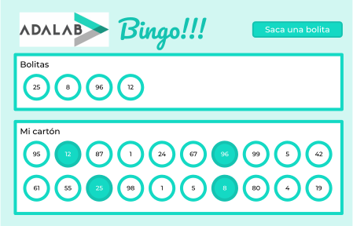

# El bingo

## Vamos a echar una partidita de bingo casero!!!

Para ver que hemos entendido las fases de la programación vamos a programar un bingo!

- Al arrancar la página:
  - La parte superior "Bolitas" debe aparecer vacía.
  - En la parte inferior "Mi cartón" deben aparecer 20 números generados aleatoriamente entre el 1 y el 100.
- A continuación:
  - Cada vez que pulsemos el botón "Saca una bolita" debemos generar y mostrar un nuevo número aleatorio del 1 al 100 en la parte "Bolitas".
  - Y destacar con un fondo verde el número de nuestro cartón que coincida con la bolita sacada. Si no coincide pues nada.
  - Como pulsar un montón de veces el botón de "Saca una bolita" es muy muy cansado, vamos a hacer que si se pulsa una vez el botón de play ► se generará una bolita nueva cada un segundo. Por supuesto también se tendrán que mostrar con fondo las bolitas de mi cartón que vayan saliendo.
- Cuando hayan aparecido todas las bolitas de los números de nuestro cartón debemos mostrar el mensaje "Han cantado bingo!!!" y ocultar los botones de "Saca una bolita" y Play.
- Fácil verdad!!!

Por cierto, si no sabes cómo generar números aleatorios no repetidos, inténtalo. Inténtalo otra vez. Luego pregunta a las compañeras. Y por último pregúntanos a los profes.

## Info extra

Hemos utilizado este ejercicio para mostrar las diferentes fases que seguimos a la hora de programar. Por ello hemos creado varias versiones del ejercicio en cada una de las carpetas **fase-1**, **fase-2**...
