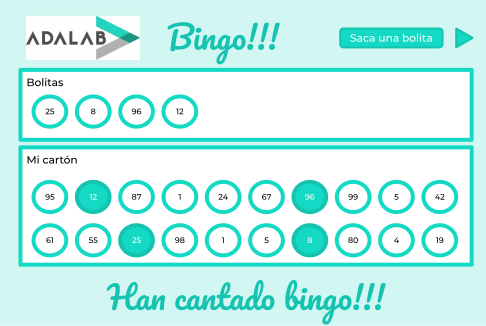

# El bingo

## Vamos a echar una partidita de bingo casero!!!

Para ver que hemos entendido las fases de la programación vamos a programar un bingo!

- Al arrancar la página:
  - La parte superior "Bolitas" debe aparecer vacía.
  - En la parte inferior "Mi cartón" deben aparecer 20 números generados aleatoriamente entre el 1 y el 100.
- A continuación:
  - Cada vez que pulsemos el botón "Saca una bolita" debemos generar y mostrar un nuevo número aleatorio del 1 al 100 en la parte "Bolitas".
  - Y destacar con un fondo verde el número de nuestro cartón que coincida con la bolita sacada. Si no coincide pues nada.
- Cuando hayan aparecido todas las bolitas de los números de nuestro cartón debemos mostrar el mensaje "Han cantado bingo!!!" y ocultar el botón "Saca una bolita".
- Fácil verdad!!!

Por cierto, si no sabes cómo generar números aleatorios no repetidos, inténtalo. Inténtalo otra vez. Luego pregunta a las compañeras. Y por último pregúntanos a los profes.

## Bonus

Os propongo un bonus para cuando nos aburrimos de jugar. Es un poco aburrido estar dándole al botón **Sacar una bolita** un montón de veces.

Vamos a añadir un botón **Play**. Cuando una usuaria pulse este botón tenemos que programar un sistema que cada segundo genere una bolita nueva en **Bolitas** y así el bingo juega solo.
