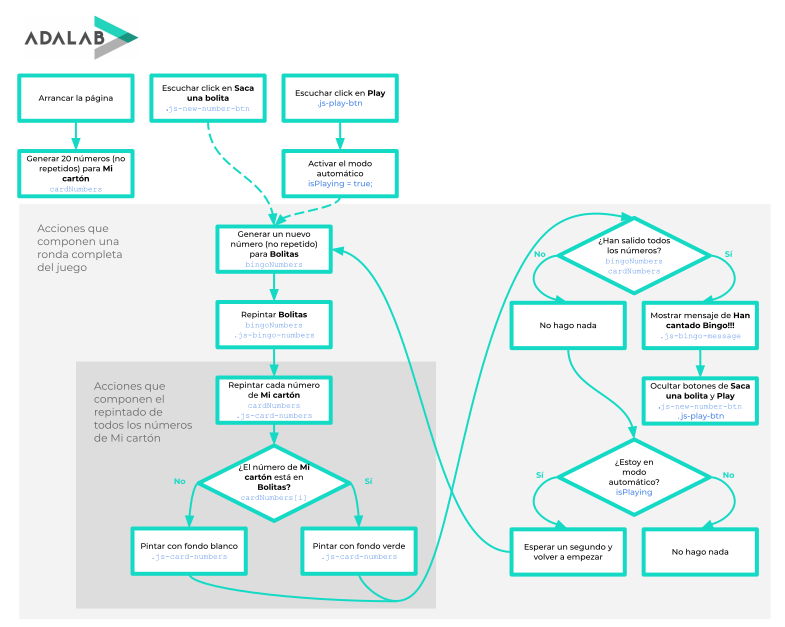

# Fase 4 y 5 de la programación: Pintar el diagrama de flujo

## ¿Qué tenemos que hacer en la fase 4?

Ahora que ya tenemos identificadas todas las cosas que intervienen en nuestra página vamos a pintar el diagrama de flujo que las relaciona.

- En la parte superior del diagrama pintamos las entradas de nuestro flujo:
  - Estas entradas son las acciones o eventos que se producen al arrancar la página.
  - Estas entradas también son las que puede hacer la usuaria.
  - Describimimos la acción, por ejemplo "Pulsar botón X", "Arrancar la página", "Escribir en el campo X"...
  - Las pintamos en rectángulos.
- Debajo de cada una de cada rectángulo de las entradas pintamos cada una de las siguientes acciones que se producen:
  - Por ejemplo "Generar número aleatorio", "Leer dato desde el input X", "Borrar datos del formulario"...
  - Estas acciones tienen que ser lo más pequeñas posibles. Dicho de otro modo, tienen que ser acciones que no podamos subdividir en otras acciones.
  - También las pintamos en rectángulos.
  - Podemos pintar tantas acciones como necesitemos.
  - Algunas de estas acciones deben ser las que hemos identificado en la fase 2 como **acciones hay que hacer cuando "finaliza" la página**.

## ¿Qué tenemos que hacer en la fase 5?

En la fase 3 hemos identificado los datos y elementos del DOM con los que vamos a trabajar. En la fase 4 hemos pintado en el flujo las acciones que hay en nuestra página.

Ahora vamos a escribir dentro de cada acción del flujo los datos y elmentos que intervienen, es decir, los datos y elementos que necesitamos leer y los datos y elementos que tenemos que modificar.

Ya tenemos el flujo completo, pero a lo mejor lo podemos simplificar.

## Fase 4 y 5 del bingo

El diagrama de flujo de la fase 4 y 5 nos queda así:

> En negro las acciones, en azul los datos y variables.
