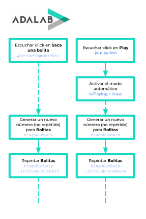

# Fase 6 de la programación: Simplificar el diagrama de flujo

## ¿Qué tenemos que hacer?

Ahora el flujo ya está completo. Pero es posible que haya cajas que hacen las mismas cosas. Vamos a intentar identificar esas cajas similares y las vamos a uninificar en una sola con el objetivo de simplificar el flujo.

Ya hemos terminado el flujo. Ahora toca programar.

## Fase 6 del bingo

En el diagrama de flujo de la fase 4 y 5 no hay mucho que simplificar ya que no hay dos cajas que hagan lo mismo.

Un error que podíamos haber cometido al hacer el flujo es que de las cajas **Escuchar click en Saca una bolita** y **Escuchar click en Play** colgasen flujos separados como mostramos en este diagrama erróneo...

