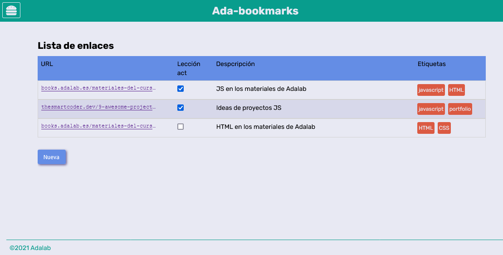
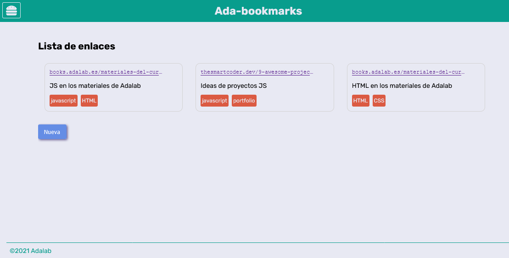

# Recopilatorio de Bookmarks

Vamos a hacer una aplicación web para ir anotando los enlaces y páginas web que nos parezcan interesantes.

La sección principal de la aplicación consta de un listado en forma de tabla (que también puede transformarse en una cuadrícula de tarjetas) donde se muestran los enlaces ya guardados por al usuaria y junto con una breve descripción, el origen y etiquetas para categorizarlos.

La aplicación tiene un menú hamburguesa (en la parte superior derecha) que al pulsar sobre él se muestran las opciones de filtrado y de visualización del listado.

Al pulsar sobre el botón de "Vista tarjetas", la lista de enlaces se convertirá en un panel de tarjetas, donde cada una contendrá la información de un enlace:

Por último, la usuaria puede añadir nuevos enlaces pulsando sobre el botón "Nueva" que mostrará un formulario para rellenar los datos del nuevo enlace a guardar.

