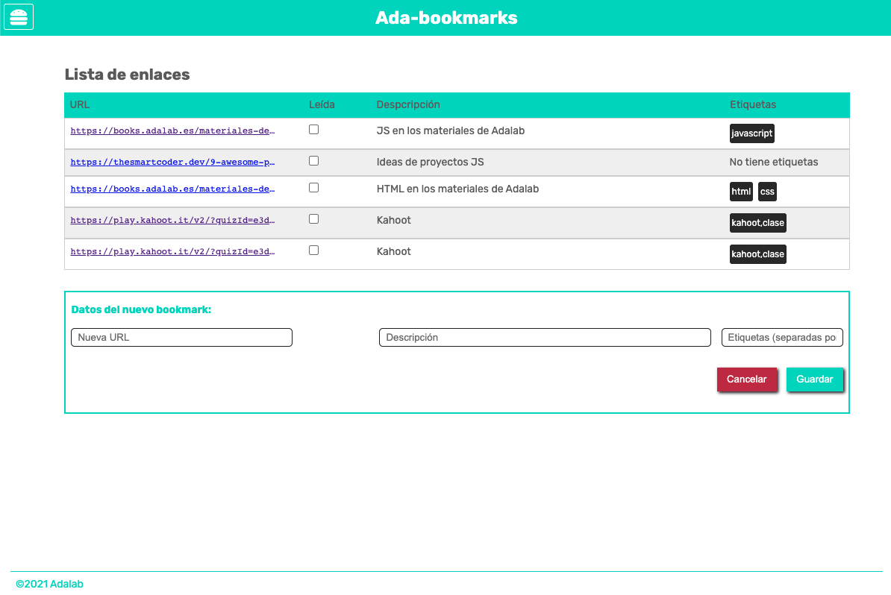
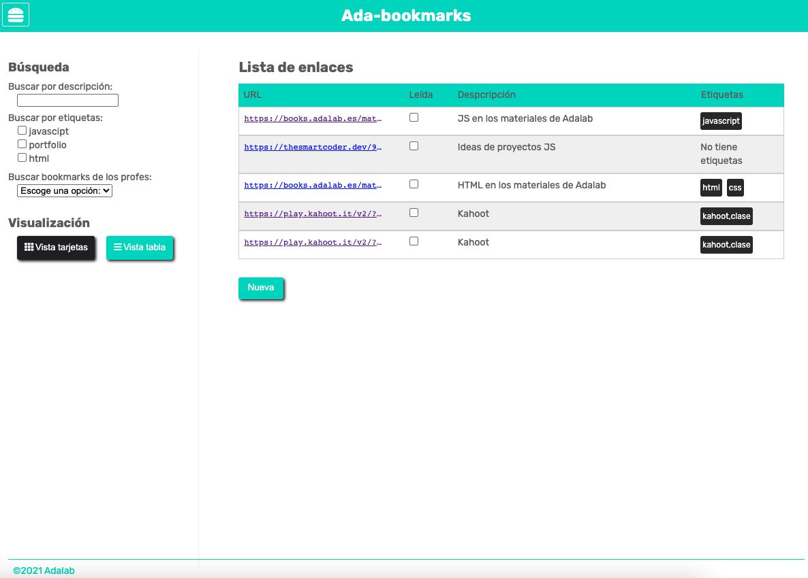

# AdaBookmark: Agregar contenido

## Ejercicios

### 1. Crear un proyecto nuevo

Empezaremos lógicamente por crear un proyecto nuevo, para lo cual:

1. Crea un repositorio en GitHub llamado `promo-X-module-2-pair-Y-sprint-Z-ada-bookmark`.
   - Cambia la `X` por tu promo, la `Y` por tu número de pareja y la `Z` por el número del sprint.
   - Crea el repo en **la organización de Adalab**.
   - Clónalo en vuestros equipos.

### 2. Muestra el formulario

Prueba a mostrar el formulario asociado al botón **Nueva**, que mostrará un formulario para rellenar los datos del nuevo marcador a guardar.

> **Pista**: Busca la sección que contiene este formulario y utiliza la propiedad classList.remove("hidden");

### 3. Muestra el menú hamburguesa

La aplicación tiene un menú hamburguesa (en la parte superior derecha) que al pulsar sobre él se muestran las opciones de filtrado y de visualización del listado. Prueba a mostrar este menú.

> **Pista**: Busca la sección que contiene este menú y utiliza la propiedad classList.remove("collapsed");

### 4. Agregar los marcadores dinámicamente

Ahora vamos a dar nuestros primeros pasos para que nuestra página sea dinámica, vamos a añadir la información estática de los marcadores que está en html desde Javascript. Para ello podemos seguir los siguientes pasos:

1.  Busca el elemento utilizando el `document.queryselector(".js-datails")`. Recuerda primero añadir esta clase de `js` a la sección de listas.
2.  Copia cada `li` dentro de una variable.
3.  Añade esa variable utilizando propiedad `innerHTML` para agregar los enlaces.
