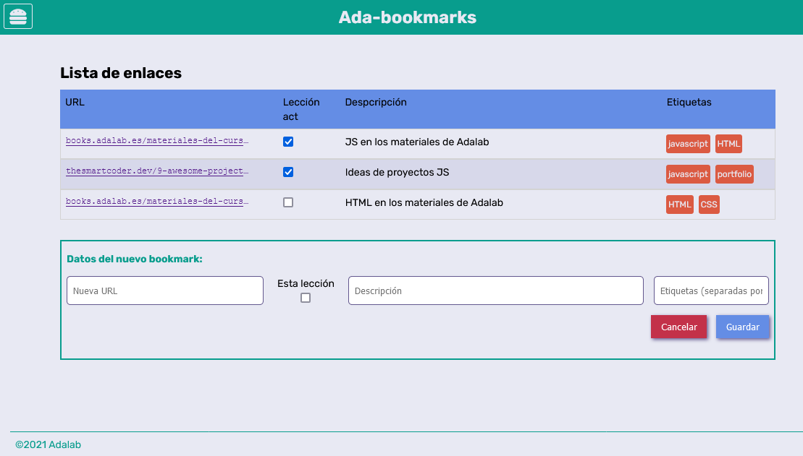
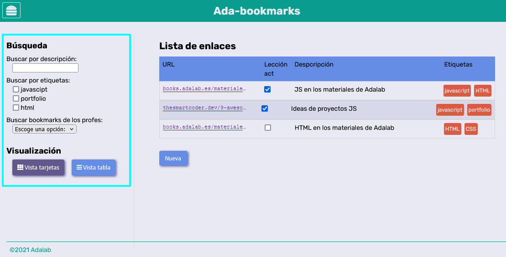

# Bookmark: Agregar contenido

## Ejercicios

### 1. Crear un proyecto nuevo

Empezaremos lógicamente por crear un proyecto nuevo, para lo cual:

1. Cread un repositorio en GitHub llamado `promo-X-module-3-pair-Y-sprint-1-hangman-game`.
   - Cambiad la `X` por tu promo y la `Y` por tu número de pareja.
   - Cread el repo en **la organización de Adalab**.
   - Clónadlo en vuestros equipos.
2. Cread un nuevo proyecto de React dentro del repo clonado.
   - Si queréis podéis hacerlo con `create-react-app` o con un `react-starter-kit`.
3. Arráncadlo y poneos a programar.

### 2. Muestra el formulario de nuevo bookmarks

La usuaria puede añadir nuevos enlaces pulsando sobre el botón "Nueva" que mostrará un formulario para rellenar los datos del nuevo enlace a guardar. Prueba a mostrar el formulario asociado al botón de nuevo bookmark.

> **Pista**: Busca la sección que contiene este formualrio y utiliza la propiedad classList.remove("hidden");

### 3. Muestra el desplegable del menú hamburguesa

La aplicación tiene un menú hamburguesa (en la parte superior derecha) que al pulsar sobre él se muestran las opciones de filtrado y de visualización del listado. Prueba a mostrar este menú.

> **Pista**: Busca la sección que contiene este menú y utiliza la propiedad classList.remove("collapsed");

### 4. Agregar los enlaces dinámicamente

Ahora vamos a dar nuestros primeros pasos para que nuestra página sea dinámica, vamos a añadir la información estática de los enlaces que está en html desde Javascript. Para ello podemos seguir los siguientes pasos:

1.  Buscad el elemento utilizando el `document.queryselector(".js-datails")`. Recuerda primero añadir esta clase de js a la sección de listas.
2.  Copiad cada `li` dentro de una variable.
3.  Añadir esa variable utilizando propiedad `innerHTML` para agregar los enlaces.
