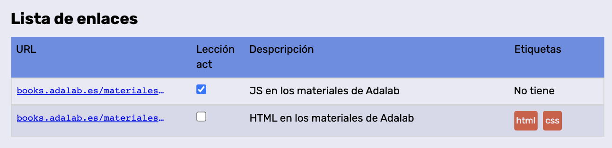

# Bookmark: Condicionales

## Ejercicio 1

Prueba a mostrar a cambiar la vista del panel de los enlaces en diferentes formatos: lista o tabla. La sección con la clase `data` añadimos las clases `tableview` para que la vista de los enlaces sea en tabla y `listview` para que se muestre en una lista, en dependencia del cual queremos activar. Para ello podemos ver cambiar la clase en el html ver si funciona correctamente:

```html
<section class="data tableview"></section>
```

> **Pista**: Utiliza condicionales y el `classList.contains`

## Ejercicio 2.

Vamos a comenzar a implementar el filtro de búsqueda por descripción. Para ello puedes:

1. Mostrar el menú hamburguesa y dejarlo siempre visible.
2. Seleccionamos el `input` con el `document.querySelector`

```js
const input_search_desc = document.querySelector(".js_in_search_desc");
```

3. Simulamos que escribe la usuaria en el `input` de búsqueda.

```js
input_search_desc.value = "materiales";
```

4. Recoger el valor del `input` en una variable.

```js
const descrSearchText = input_search_desc.value;
```

5. Utilizar la función `includes` antes de añadir cada enlace para solo mostrar aquellos enlaces que contengan la palabra introducida por la usuaria:

```js
if( bmk_2_desc.includes(descrSearchText) ) {
    ....
```

## Ejericio 3. BONUS

Vamos a validar la columna de las categorías de los enlaces: Si el enlace no tiene categoría mostraremos el mensaje **No tiene categorías**.



Para ello podemos verificar si las categorías tienen algún valor, y en dependencia del resultado del condicional mostrar un resultado u utro.

```js
if ((bmk_1_tags_1 === "") & (bmk_1_tags_2 === "")) {
  html += `<p class='item__tags'>No tiene</p>`;
} else {
  ...
}
```

## Ejercicio 4. BONUS

Cambia el valor de la variable `bmk_1_seen` a `true` o `false`. En dependencia de este valor muestra seleccionado o no el `input` de tipo `checkbox`.
