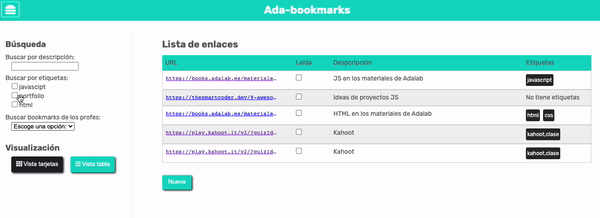

# AdaBookmark: Funciones

Antes de hacer los ejercicios, coloca tus variables al principio del fichero `js`. Después, pondremos las funciones y en último lugar el código a ejecutar cuando se cargue la página.

## Ejercicios

### 1. Cambiar la vista de los marcadores

Haz dos funciones (llamemoslas `displayTableView()` y `displayCardListView()`) para cambiar la visualización de los marcadores: tabla o tarjetas. Estas funciones no reciben parámetros ni devuelven valor alguno.

Puedes usar las nuevas funciones dentro de los if del ejercicio de ayer... o no, puedes usarlas también desde la consola para probarlas.


### 2. Mostrar/ocultar el menú

Has dos funciones (se pueden llamar `showDropdownMenu()` y `hideDropdownMenu()`) para mostrar u ocultar el menú de visualización. ¿Necesitan recibir parámetros? ¿Devolverán algún valor?

Puedes probar estas funciones llamándolas desde la consola de las DevTools.



### 3. Mostrar/ocultar el formulario

Haz una función llamada `showAddFrom()` que al ejecutarla nos muestre en la página el formulario para crear un nuevo marcador. También agrega la función para cerrar el formulario cuando se cancela la acción.


### 4. Mostrar las etiquetas

Haz una función que se llame `renderBookmarkTags()` que reciba dos palabras (`strings`) como parámetros y nos devuelva como valor de retorno código HTML en un string. Este código tiene que ser:

- Si recibe dos palabras, devolverá el HTML que muestra la lista de etiquetas con una lista `ul`:

```html
<ul class="item__tags">
  <li class="item__tag">Etiqueta 1</li>
  <li class="item__tag">Etiqueta 2</li>
</ul>
```

- Si recibe una palabra en el primer parámetro pero el otro parámetro es un string vacío `''`, devolverá también HTML con una lista `<ul>` pero sólo con la palabra indicada por el primer parámetro.

```html
<ul class="item__tags">
  <li class="item__tag">Etiqueta</li>
</ul>
```

- Si recibe dos string vacíos como parámetros devolverá código HTML, pero esta vez será un párrafo diciéndo que no hay etiquetas:

```html
<p class="item__tags">No tiene</p>
```

Puedes probar esta función en la consola de las DevTools y ver qué HTML te devuelve en cada caso.


**BONUS:** Puedes "perfeccionar" la función para que tenga en cuenta si las etiquetas traen texto o un string vacío o undefined.

### 5. Crear el marcador en HTML

Haz una función que se llame `renderBookmark()` y que reciba como parámetros todos los datos que tenemos de un marcador (URL, descripción, si esta leído o no y etiquetas). Devolverá como valor de retorno un `string` con todo el HTML que representa al marcador en la página.

La declaración de esta función podría ser así:

```js
function renderBookmark( url, desc, lesson, tags_1, tags_2 ) {
    ...
}
```

¿Necesitas llamar a la función del ejercicio 4 para hacer esta función?

¿Cómo podrías usar esta función para generar y poner en la página el HTML de cada marcador que tenemos?
