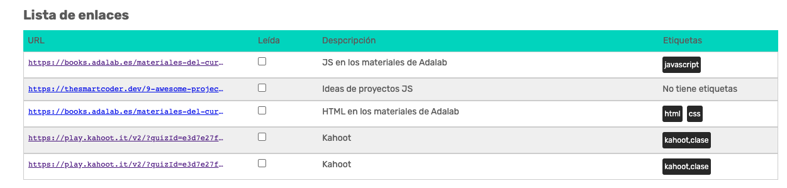

# Aplicación AdaBookmarks

## Enunciado del ejercicio

Todos los dias leemos y revisamos muchas páginas donde obtenemos información, estudiamos, hacemos nuestros apuntes... Es muy fácil que con la cantidad de información que hay en Internet, ese contenido que hemos consultado desaperezca.

Una solución es guardar los enlaces con la información para siempre, de esta manera puedes consultarlos y volver a vistarlos cuando lo necesites. Las aplicaciones de marcadores organizan y almacenan marcadores a largo plazo, y en este módulo nos vamos a plantear como reto desarrollar una aplicación de marcadores **AdaBookmarks** en la sesiónes de pair programing.

## Descripción de la aplicación

Os contamos lo que haremos durante el módulo para implementar la aplicación:


1. La sección principal de la aplicación consta de un listado en forma de tabla (que también puede transformarse en una cuadrícula de tarjetas) donde se muestran los enlaces ya guardados por al usuaria y junto con una breve descripción, el origen y etiquetas para categorizarlos.
2. La aplicación tiene un menú hamburguesa (en la parte superior derecha) que al pulsar sobre él se muestran las opciones de filtrado y de visualización del listado.
   - Al pulsar sobre el botón de "Vista tarjetas", la lista de marcadores se convertirá en un panel de tarjetas, donde cada una contendrá la información de un marcador.
3. Por último, la usuaria puede añadir nuevos marcadores pulsando sobre el botón "Nueva" que mostrará un formulario para rellenar los datos del nuevo marcador a guardar.

# AdaBookmark: Agregar contenido

## Ejercicios

### 1. Crear un proyecto nuevo

Empezaremos lógicamente por crear un proyecto nuevo, para lo cual:

1. Crea un repositorio en GitHub llamado `promo-X-module-2-pair-Y-sprint-Z-ada-bookmark`.
   - Cambia la `X` por tu promo, la `Y` por tu número de pareja y la `Z` por el número del sprint.
   - Crea el repo en **la organización de Adalab**.
   - Clónalo en vuestros equipos.

### 2. Muestra el formulario

Prueba a mostrar el formulario asociado al botón **Nueva**, que mostrará un formulario para rellenar los datos del nuevo marcador a guardar.

> **Pista**: Busca la sección que contiene este formulario y utiliza la propiedad classList.remove("hidden");


### 3. Muestra el menú hamburguesa

La aplicación tiene un menú hamburguesa (en la parte superior derecha) que al pulsar sobre él se muestran las opciones de filtrado y de visualización del listado. Prueba a mostrar este menú.

> **Pista**: Busca la sección que contiene este menú y utiliza la propiedad classList.remove("collapsed");


### 4. Agregar los marcadores dinámicamente

Ahora vamos a dar nuestros primeros pasos para que nuestra página sea dinámica, vamos a añadir la información estática de los marcadores que está en html desde Javascript. Para ello podemos seguir los siguientes pasos:

1.  Busca el elemento utilizando el `document.queryselector(".js-datails")`. Recuerda primero añadir esta clase de `js` a la sección de listas.
2.  Copia cada `li` dentro de una variable.
3.  Añade esa variable utilizando propiedad `innerHTML` para agregar los enlaces.

# AdaBookmark: Variables

## Ejercicios

### 1. Interpolar variables

Vamos a usar variables que luego interpolaremos en el string con el HTML de cada marcador. Os proponemos usar 6 variables por cada uno:

1. Una variable para la URL (dirección del marcador).
1. Una variable para la descripción
1. Una variable para indicar si está leido o no.
1. Otras dos variables que indiquen las etiquetas de ese marcador.
1. Una última variable con el HTML del marcador en la que interpolaremos las anteriores.

Por ejemplo:

```js
const bmk_1_url =
  "https://books.adalab.es/materiales-del-curso-n/-MdR6Gp68BX20m1pi0z2/modulo-2-programando-la-web/javascript/2_1_intro_a_la_programacion";
const bmk_1_desc = "JS en los materiales de Adalab";
const bmk_1_seen = "checked";
const bmk_1_tags_1 = "javascript";
const bmk_1_tags_2 = "html";
```

> **Nota** : Usamos \_ en los nombres de las variables, pero por una razón académica.
> En JS se suele usar la notación [camelCase](https://es.wikipedia.org/wiki/Camel_case) para los nombres de variable.

### 2. Bonus: Convertir cadenas de carácteres

¿Serías capaz de buscar métodos de `string` para pasar a minúsculas el nombre de las etiquetas?

### 3. Bonus: Reemplaza contenido

¿Serías capaz de quitar el `https://` del principio de la dirección en el contenido del enlace usando otro método de `string`? No lo quites en el html en la propiedad `href`.

---

> Nota.- Comenta el código de ayer en el que se mostraban el menú y el formulario.

# AdaBookmark: Condicionales

## Ejercicios

### 1. Visualización de los marcadores

Prueba a cambiar la vista del panel de los marcadores en diferentes formatos: lista o tabla.

A la sección con la clase `data` añadimos las clases `tableview` para que la vista de los enlaces sea en tabla y `listview` para que se muestre en una lista, en dependencia del cual queremos activar. Para ello podemos ver cambiar la clase en el html ver si funciona correctamente:

```html
<section class="data tableview"></section>
```

> **Pista**: Utiliza condicionales y el `classList.contains`

### 2. Búsqueda por descripción

Vamos a comenzar a implementar el filtro de búsqueda por descripción:

1. Muestra el menú hamburguesa y dejalo siempre visible.
2. Selecciona el `input` con el `document.querySelector`

```js
const input_search_desc = document.querySelector(".js_in_search_desc");
```

3. Simula que escribe la usuaria en el `input` de búsqueda.

```js
input_search_desc.value = "materiales";
```

4. Recoge el valor del `input` en una variable.

```js
const descrSearchText = input_search_desc.value;
```

5. Utiliza la función `includes` antes de añadir cada marcador para solo mostrar aquellos marcadores que contengan la palabra introducida por la usuaria:

```js
if( bmk_2_desc.includes(descrSearchText) ) {
    ....
```

### 3. BONUS: No hay categorías, ¿qué se muestra entonces?

Valida la columna de las categorías de los marcadores: Si el marcador no tiene categoría mostraremos el mensaje **No tiene etiquetas**.


Verifica si las categorías tienen algún valor, y en dependencia del resultado muestra el resultado.

```js
if ((bmk_1_tags_1 === "") & (bmk_1_tags_2 === "")) {
  html += `<p class='item__tags'>No tiene</p>`;
} else {
  ...
}
```

### 4. BONUS: Macadores leídos

Cambia el valor de la variable `bmk_1_seen` a `true` o `false`. En dependencia de este valor muestra seleccionado o no el `input` de tipo `checkbox`.

# AdaBookmark: Funciones

Antes de hacer los ejercicios, coloca tus variables al principio del fichero `js`. Después, pondremos las funciones y en último lugar el código a ejecutar cuando se cargue la página.

## Ejercicios

### 1. Cambiar la vista de los marcadores

Haz dos funciones (llamemoslas `displayTableView()` y `displayCardListView()`) para cambiar la visualización de los marcadores: tabla o tarjetas. Estas funciones no reciben parámetros ni devuelven valor alguno.

Puedes usar las nuevas funciones dentro de los if del ejercicio de ayer... o no, puedes usarlas también desde la consola para probarlas.


### 2. Mostrar/ocultar el menú

Has dos funciones (se pueden llamar `showDropdownMenu()` y `hideDropdownMenu()`) para mostrar u ocultar el menú de visualización. ¿Necesitan recibir parámetros? ¿Devolverán algún valor?

Puedes probar estas funciones llamándolas desde la consola de las DevTools.


### 3. Mostrar/ocultar el formulario

Haz una función llamada `showAddFrom()` que al ejecutarla nos muestre en la página el formulario para crear un nuevo marcador. También agrega la función para cerrar el formulario cuando se cancela la acción.


### 4. Mostrar las etiquetas

Haz una función que se llame `renderBookmarkTags()` que reciba dos palabras (`strings`) como parámetros y nos devuelva como valor de retorno código HTML en un string. Este código tiene que ser:

- Si recibe dos palabras, devolverá el HTML que muestra la lista de etiquetas con una lista `ul`:

```html
<ul class="item__tags">
  <li class="item__tag">Etiqueta 1</li>
  <li class="item__tag">Etiqueta 2</li>
</ul>
```

- Si recibe una palabra en el primer parámetro pero el otro parámetro es un string vacío `''`, devolverá también HTML con una lista `<ul>` pero sólo con la palabra indicada por el primer parámetro.

```html
<ul class="item__tags">
  <li class="item__tag">Etiqueta</li>
</ul>
```

- Si recibe dos string vacíos como parámetros devolverá código HTML, pero esta vez será un párrafo diciéndo que no hay etiquetas:

```html
<p class="item__tags">No tiene</p>
```

Puedes probar esta función en la consola de las DevTools y ver qué HTML te devuelve en cada caso.



**BONUS:** Puedes "perfeccionar" la función para que tenga en cuenta si las etiquetas traen texto o un string vacío o undefined.

### 5. Crear el marcador en HTML

Haz una función que se llame `renderBookmark()` y que reciba como parámetros todos los datos que tenemos de un marcador (URL, descripción, si esta leído o no y etiquetas). Devolverá como valor de retorno un `string` con todo el HTML que representa al marcador en la página.

La declaración de esta función podría ser así:

```js
function renderBookmark( url, desc, lesson, tags_1, tags_2 ) {
    ...
}
```

¿Necesitas llamar a la función del ejercicio 4 para hacer esta función?

¿Cómo podrías usar esta función para generar y poner en la página el HTML de cada marcador que tenemos?

# AdaBookmark: Eventos

## Ejercicios

### 1. Mostrar/ocultar menú

Agrega un evento para cuando damos `click` en el botón hamburguesa. Haz una función (podemos llamarla `handleClickLinkDropdown`) que muestra u oculta el menú colapsable dependiendo de su estado actual.

> **Nota**:
> Recuerda utilizar el `event.preventDefault()`.
> La clase `collapsed` es la que muestra y/u oculta el menú colapsable.

### 2. Marcadores en vista tarjetas

Haz las funciones necesarias para cambiar la vista de los marcadores a tarjetas.

- Agrega un evento `click` al botón "Vista Tarjetas" del menú que cambie la vista a tarjetas de los marcadores.
- Agrega y/o elimina la clase `selected` de los botones para resaltarlo.

```js
...
  buttonShowTable.classList.remove('selected');
  buttonShowCardview.classList.add('selected');
...
```

### 3. Marcadores en vista tabla

Haz el código necesario para cambiar la vista de los marcadores a tabla.

- Agrega un evento `click` al botón "Vista Tabla" del menú que cambie la vista a tabla de los marcadores.
- Agrega y/o elimina la clase `selected` de los botones para resaltarlo.

```js
...
buttonShowCardview.classList.remove('selected');
buttonShowTable.classList.add('selected');
...
```

### 4. Mostrar/ocultar formulario

Crea el evento para mostrar el formulario de añadir una nueva tarjeta cuando damos `click` en el botón **Nueva**. Para ello puedes hacer uso de la función `showAddForm()`.

```js
//función que muestra el formulario para agregar un nuevo enlace

function showAddForm() {
  sectionAdd.classList.remove("hidden");
}
```

# AdaBookmark: Objetos

## Ejercicios

### 1. Convertir el marcador en un objeto

Crea un objeto `bmkData` para cada uno de los enlaces que contenga toda la información de las variables: `bmk_1_url`, `bmk_1_desc`, `bmk_1_seen`, `bmk_1_tags_1`, `bmk_1_tags_2`. Por ejemplo:

```js
//objeto con la información del primer enlace
const bmkData_1 = {
  url: "https://books.adalab.es/materiales-del-curso-n/-MdR6Gp68BX20m1pi0z2/modulo-2-programando-la-web/javascript/2_1_intro_a_la_programacion",
  desc: "JS en los materiales de Adalab",
  seen: true,
  tags_1: "javascript",
  tags_2: "",
};
```

Luego modifica la función `renderBookmark()` para que reciba un objeto como parámetro.

```js
...
function renderBookmark(bmkData) {
...
```

Ten en cuenta que también debes modificar la funcion los parámetros de las funciones `renderTags()` y `renderSeen()`.

# AdaBookmark: Arrays

## Ejercicios

### 1. Crear listado de marcadores

Hoy vamos a crear una única variable `bmkData` que almacenará los datos de todos los enlaces como un array. Podemos usar las variables con objetos del ejercicio de ayer para crear este array:

```js
// Objeto con la información del primer enlace
const bmkData_1 = {
  url: "https://books.adalab.es/materiales-del-curso-n/-MdR6Gp68BX20m1pi0z2/modulo-2-programando-la-web/javascript/2_1_intro_a_la_programacion",
  desc: "JS en los materiales de Adalab",
  seen: true,
  tags_1: "javascript",
  tags_2: "",
};

// Objeto con la información del segundo enlace
const bmkData_2 = {
  /* ... */
};

// Objeto con la información del tercer enlace
const bmkData_3 = {
  /* ... */
};

// Lista con la información de todos los enlaces
const bmkData = [bmkData_1, bmkData_2, bmkData_3];
```

## 2. BONUS: Crear listado de etiquetas

Vamos a hacer un array también con las etiquetas de cada bookmark. Será un array dentro de un objeto dentro del array de todos los bookmark (ufff).

Debemos quitar las propiedades `tags_1` y `tags_2` de cada objeto con datos de cada Bookmark y agruparlos en una única propiedad `tags` que sea un array con los dos valores de las etiquetas. Puedes retirar los valores que sean cadenas vacías (así tendremos arrays de 0, 1 ó 2 elementos).

También deberemos modificar la función `renderTags()` para que reciba como parámetro una única variable que sea el array de tags, pero su valor de retorno deberá ser el mismo. Recuerda cambiar el argumento que le pasas a esta función dentro de la función `renderBookmark()`.

# Bookmark: Arrays II

## Ejercicios

### 1. Agregar nuevo marcador

Vamos a añadir un nuevo marcador al listado desde el formulario.


Haz una nueva función manejadora del evento `click` del botón **Guardar** del formulario, podemos llamarla `saveNewBookmark(ev)`. Esta función obtiene los valores de cada uno de los inputs, crea un nuevo objeto `newBookmarkDataObject` que agregaremos al listado de enlaces con la siguiente línea de código:

```js
bmkData.push(newBookmarkDataObject);
```

Recuerda limpiar los valores de los `inputs` y volver a ocultar la sección del formulario.

## 2. Cancelar formulario

Haz el código necesario para ocultar la sección del fomulario de añadir un nuevo enlace. Recuerda tambien limpiar los valores de los `inputs`.


# AdaBookmark: Peticiones al servidor I

## Ejercicios

### 1. Obtener marcadores desde el servidor

Vamos a obtener la lista de marcadores de un servidor, hemos creado un servidor que devuelve un listado con la información de los marcadores de un usuario en formato `json`:

```js
...

    {
    "id": "16396904232462016",
    "owner": "adalabdigital",
    "url": "https://books.adalab.es/materiales-del-curso-o/XwqEzZ1o5Xgza96sxhld/modulo-2-programando-la-web/javascript/2_1_intro_a_la_programacion",
    "description": "JS en los materiales de Adalab",
    "module": false,
    "tags": [ "javascript"]
    },

...
```

Prueba la siguiente petición en en tu navegador con tu usuario de GitHub:
https://adalab-bookmarks-api.herokuapp.com/api/bookmarks/tuusuariodegithub

Haz un `fetch` para obtener el listado los enlaces y mostrarlos en la página de los marcadores.

# AdaBookmark: Peticiones al servidor II

## Ejercicios

### 1. Guardar en el local storage

Guarda los datos de los marcadores en el local storage, asi cada vez que se inicie la aplicación primero busque si los datos están almacenados en el local storage y en caso de que no estén, entonces se hará la petición de los datos al servidor.

### 2. BONUS: Crear un nuevo marcador

Guarda un nuevo marcador en el servidor, haz una petición `post` para guardar los datos a la siguiente dirección: https://adalab-bookmarks-api.herokuapp.com/api/bookmark/tuusuariodegithub.

### 3. BONUS: Modifica un marcador

Haz fetch al servidor al cambiar el campo de Leído de un marcador. Usa el servidor https://adalab-bookmarks-api.herokuapp.com/api/bookmark/tuusuariodegithub/iddelbookmark con el método `put`.

# AdaBookmark: Métodos funcionales de arrays

## Ejercicios

### 1. Filtrar por descripción

El menú lateral de la aplicación tiene un `input` para realizar búsquedas. Haz el código necesario para filtrar según la descripción de los marcadores. Utiliza el método de arrays `filter`.


### 2. BONUS: Filtrar por si está leido o no

Agrega el código necesario para filtrar si el enlace está leido o no, además de la descripción. Utiliza el método de arrays `filter`.


### 3. BONUS: Filtrar por etiquetas

Agrega una nueva funcionalidad que permita filtrar por las etiquetas, además de filtrar si el enlace está leido o no y por la descripción. Utiliza el método de arrays `filter`.


# AdaBookmark: DOM Avanzado

## Ejercicios

### 1. Cambiar a DOM Avanzado

Cambia los innerHTML de las funciones `renderTags()`, `renderSeen()` y `renderBookmark()` por sentencias de creación de elementos.

Probablemente la función `renderSeen()` ya es útil como está y nos conviene hacer funciones para cada campo: `renderURL()`, `renderSeen()`, `renderDescription()` y `renderTags()`.
