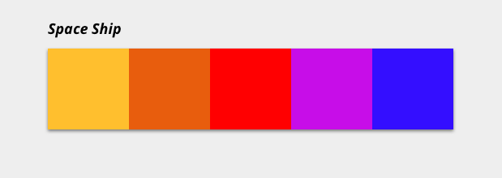

# El ejericicio de las paletas

## 1º Todo es color entre tú y tus arrays...

Vamos a sacar a la diseñadora que llevamos dentro: queremos pintar paletas que podríamos usar en diferentes páginas web, y como somos unas freaks pues a cada paleta le ponemos nombres de naves espaciales de películas, a lo loco.

Esta vez tenemos una URL **https://beta.adalab.es/ejercicios-extra/js-ejercicio-de-paletas/data/palette.json** que nos devuelve datos de una paleta y tenemos que pintarla como en el ejemplo:



Pero hay uno requisito:

- Podemos crear los estilos que estimemos oportunos pero el color de la paleta lo añadiremos con un atributo `style=""` en cada cuadrado, es decir, si cada cuadrado fuese un **div** podría quedar algo así:

```html
<div class="color__item" style="background-color:#ffcc00"></div>
```

De esta manera aplicaremos el color a cada cuadrado.

## 2º El retorno de las paletas

Ahora que sabemos pintar una paleta vamos a ver las paletas de las mejores naves de ciencia ficción, en esta URL **https://beta.adalab.es/ejercicios-extra/js-ejercicio-de-paletas/data/palettes.json** tenemos a las mejores: ¡¡¡Píntalas todas!!

## 3º Mis paletas preferidas

Una vez las tengas todas pintadas vamos a permitir que la usuaria seleccione sus paletas preferidas. Al hacer clic en cualquiera de ellas tenemos que añadirle alguna clase que la marque como seleccionada. Como hay mucha gente a la que le cuesta decidir dejaremos que marquen como preferidas tantas paletas como quieran.

## 4º Buceando entre naves

Ahora vamos a dejar que la usuaria filtre por nombre de nave, para ello tenemos que añadir una caja de búsqueda. Cada vez que se escriba una letra filtraremos. Si la usuaria escribe 'a' solo pintaremos las naves cuyo nombre contengan 'a', si escribe 'ac' as que contengan 'ac'. Y así!

## 5º ¡Cachés a mi!

Estamos haciendo muchas peticiones al servidor cada vez que alguien visita la web. Y hemos visto que muchas veces es una usuaria que ya la visitó antes. Vamos a cachear la respuesta de nuestro fetch en localStorage.
La idea es que al cargar la página podamos consultar el LS, si ya están las paletas guardadas las pintamos directamente y nos ahorramos una petición. Sino hacemos nuestro fetch ;)
