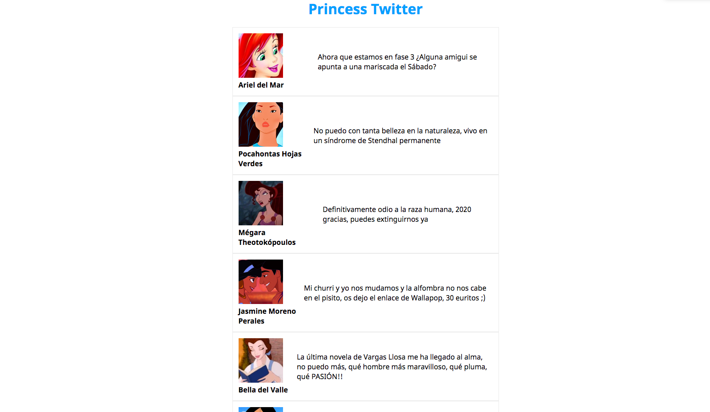

# Princess Twitter 
Ha llegado a nuestras manos un proyecto muy interesante, ¡hacer una red social!. Pero no cualquier red social, para la gente normal ya existe Twitter e Instagram. Nos han pedido hacer una red social para princesas Disney ❤️, un lugar en el que puedan conectarse y comprenderse con sus problemas típicos del día a día que nosotras jamás entenderíamos...

Nuestro cliente nos ha dado una URL de la que debemos extraer los datos, ya que tienen montado el back y nosotras solamente tenemos que pintar la información en el front.

**FLUJO**:
Al cargar la página debemos pintar un listado de princesas con la siguiente información:
- Nombre
- Foto
- Comentario de la princesa

Al hacer click sobre una princesa podemos cambiarle el fondo a color azul claro para marcarla como nuestra amiga.

Extraeremos los datos de la siguiente URL: 'https://beta.adalab.es/ejercicios-extra/js-fetch-arrays-princesas-disney/data/users.json'
Ejemplo de objeto que llega del servidor:

 ```js
{
	"name":"Ariel del Mar",
	"email":"dangerousRedHair@example.com",
	"phone":"0424-4724697",
	"comment":"Ahora que estamos en fase 3 ¿Alguna amigui se apunta a una mariscada el Sábado?",
	"picture":"http://beta.adalab.es/ejercicio-fin-de-semana-promo-j/data/images/ariel.jpg"
}
```

Ejemplo de diseño


\_\_\_\_\_\_\_\_\_\_

La finalidad de este ejercicio no es que lo realices obligatoriamente, es para practicar y asimilar conceptos. No se va a corregir en clase así que no tienes que terminarlo si no puedes, la semana que viene subiremos la solución para que puedas razonarlo y completar la solución por tí misma si no lo has conseguido.

Te recomendamos que analices la lógica, pintes en un papel, pienses en las herramientas de las que dispones antes de escribir código....

No es obligatorio subirlo a ningún repo.¡Puedes hacerlo!

¡¡Diviértete pero no te olvides de descansar!!

🦄🦄🦄💩💩💩
