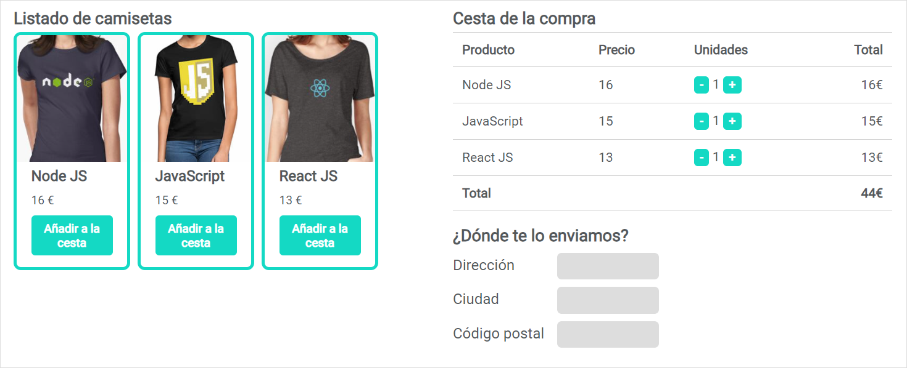
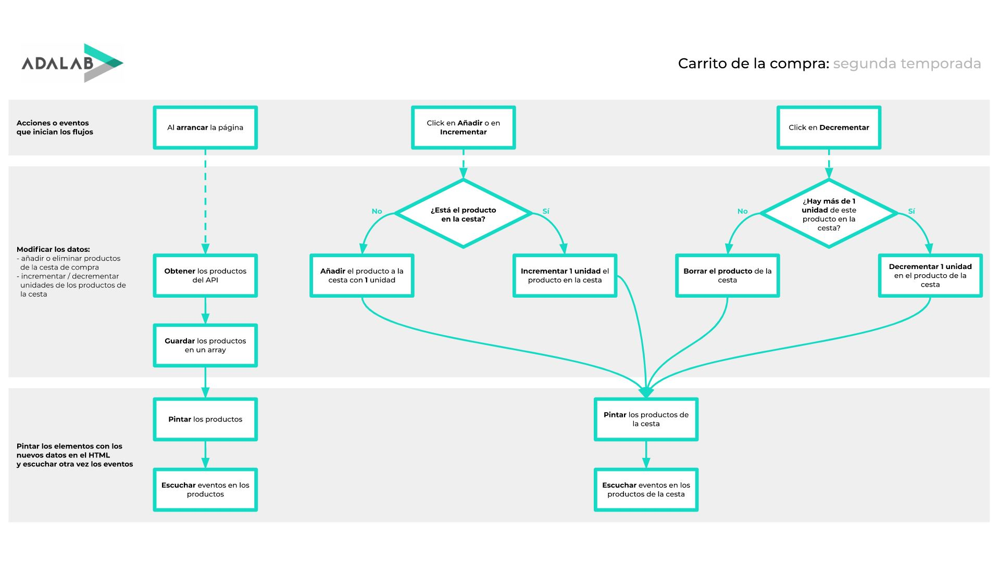

## La tienda de camisetas

En las lecciones de estos materiales solemos trabajar sobre ejercicios pequeños y aislados con los que practicamos los conocimientos aprendidos en un día.

Hemos querido prepararos un ejercicio global y completo que relaciona todos los conceptos aprendidos durante todo el módulo 2 de JavaScript.

Este ejercicio se grabó con público en directo en clase, durante el **módulo 2 de la Promo Idelisa**. Y es una tienda online de camisetas molonas:

### Temporadas

- El ejercicio está compuesto de 2 temporadas.
- Temporada 1:
   - Esta temporada se grabó en clase.
   - **Los capítulos siguen el mismo orden que las lecciones** del temario de Adalab.
   - En cada capítulo se aplican los conceptos explicados dicho día en clase.
   - Este **no es el orden lógico a la hora de afrontar un ejercicio**. Lo normal es tener todos los conocimientos antes de ponernos a realizar el ejercicio.
- Temporada 2:
  - Esta temporada se grabó después de terminar el módulo, cuando ya sabíamos programar en Javascript.
  - **Los capítulos siguen el orden lógico que usamos cuando ya tenemos todos los conocimentos necesarios para hacer un ejercicio** como este.
  - Este es el mismo orden que usamos normalmente cuando trabajamos.

### Capítulos

- Cada temporada está compuesta de 5 capítulos.
- El código fuente HTML, JS y CSS de cada capítulo está en su respectiva carpeta en el [repositorio de ejercicios extra > tshirt eshop](https://github.com/Adalab/ejercicios-extra/tree/master/js-tshirt-eshop).
- El código fuente que hay en estas carpetas es código que hay al final de cada capítulo.

### Vídeos

- Cada capítulo está dividido en varios vídeos.

### T1E1: Funciones

- [Crear mi primera función](https://www.youtube.com/watch?v=dJVQEwj4DAw)
- [Parámetros y argumentos de una función](https://www.youtube.com/watch?v=52PYwK8Pzp0)
- [Retorno de una función](https://www.youtube.com/watch?v=rT23aCe_GdA)
- [Reutilizar una función](https://www.youtube.com/watch?v=8v3wb2GqorA)

### T1E2: Eventos

- [En capítulos anteriores...](https://www.youtube.com/watch?v=bCkAZNwc_7A)
- [Escuchar un evento de un elemento](https://www.youtube.com/watch?v=I6cMxIyJM5w)
- [Obtener información del evento o elemento](https://www.youtube.com/watch?v=FylFQzFv0_M)
- [Escuchar eventos después de pintarlos](https://www.youtube.com/watch?v=BIFqQQ137jQ)

### T1E3: Objetos

- [Qué es un objeto](https://www.youtube.com/watch?v=A9WwI375pa0)
- [Crear nuestro primer objeto](https://www.youtube.com/watch?v=_CoVS300gZY)
- [Formas de crear un objeto](https://www.youtube.com/watch?v=eGrVfK1NyLo)
- [Bonus: métodos y this](https://www.youtube.com/watch?v=VlkbwK8dblo)

### T1E4: Arrays

- [En capítulos anteriores...](https://www.youtube.com/watch?v=wyl_pV0aF_U)
- [Qué es un array](https://www.youtube.com/watch?v=SeElRGix1Fk)
- [Recorrer arrays con un for...of](https://www.youtube.com/watch?v=SsENDfG0G0w)
- [Recorrer arrays con un for clásico](https://www.youtube.com/watch?v=int-_ULESrU)

### T1E5: Peticiones al servidor

- [En capítulos anteriores...](https://www.youtube.com/watch?v=s8e0ZPWSSkM)
- [Fetch](https://www.youtube.com/watch?v=o2276PjYIcs)
- [Bonus: crear un servidor o API local](https://www.youtube.com/watch?v=8qJfOsafzDE)

### T2: Diagrama de flujo

### T2E1: Obtener datos del API y pintarlos

- [Introducción](https://www.youtube.com/watch?v=TsTQBkF-y2w)
- [Obtener productos del API de GitHub Pages](https://www.youtube.com/watch?v=dKehsRSnMvo)
- [Obtener productos del API local](https://www.youtube.com/watch?v=B5zzYnHEtaE)
- [Pintar productos](https://www.youtube.com/watch?v=4poyJw6wJYA)

### T2E2: Eventos

- [Escuchar el evento click](https://www.youtube.com/watch?v=4on3yF98gfE)
- [Identificar un producto clickado](https://www.youtube.com/watch?v=ZuwfcX12OtQ)
- [Añadirlo al array de la cesta](https://www.youtube.com/watch?v=gNnaF2iQXZ8)
- [Pintar la cesta de la compra](https://www.youtube.com/watch?v=B2VqxV_vpqU)
- [Comprobar si el producto está en la cesta](https://www.youtube.com/watch?v=Knfdcos_KeE)
- [Qué pasa si me atasco](https://www.youtube.com/watch?v=ETnZOhKNrP8)

### T2E3: Más eventos

- [Escuchar click en incrementar](https://www.youtube.com/watch?v=ZQmwElypMtE)
- [Escuchar click en decrementar](https://www.youtube.com/watch?v=VSs6B1WxZT8)
- [Limpiar código](https://www.youtube.com/watch?v=zreRs2RhpA0)

### T2E4: Local storage

- [Guardar en el local storage](https://www.youtube.com/watch?v=2i6HyR8yi4Q)
- [Leer del local storage](https://www.youtube.com/watch?v=QpbiW20wXrk)
- [Buenas prácticas](https://www.youtube.com/watch?v=J0PaxYMi82M)

### T2E5: Refactorizar

- [Unificar addEventListener](https://www.youtube.com/watch?v=1r9_sivUYMI)
- [Métodos funcionales de array](https://www.youtube.com/watch?v=NNwTRnOnJWs)
- [Funciones que deciden vs funciones que ejecutan](https://www.youtube.com/watch?v=V3qlrzjP--g)